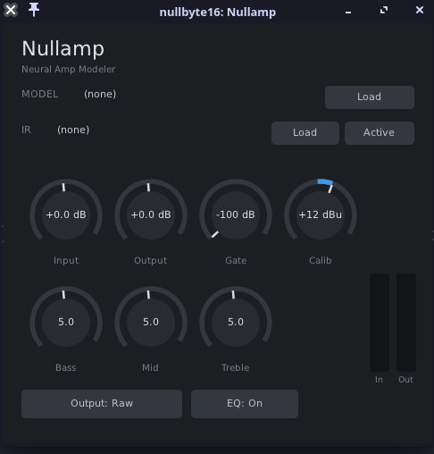

<div align="center">

# Nullamp

A Linux guitar amp plugin that plays [Neural Amp Modeler](https://www.neuralampmodeler.com/) captures.

[](https://github.com/nullbyte61/nullamp/actions/workflows/build.yml)
[](LICENSE)




</div>

## Overview

Nullamp loads `.nam` amp captures and runs them in real time. Around the model it gives you a full
channel strip: a noise gate, a tone stack, a cabinet impulse response, and output levelling. One C++
codebase builds to LV2, CLAP, VST3, and a standalone JACK application.


Nullamp is an independent project. It is not affiliated with Neural Amp Modeler or its authors; it
just plays the models their trainer produces.

## Features

- Plays any `.nam` capture (WaveNet and LSTM, including A2 and slimmable models).
- Loads a cabinet IR (`.wav`) and resamples it to the session rate.
- Full chain: noise gate, amp model, 3-band tone stack, cab IR, DC blocker, output.
- Three output modes: Raw, Normalized, and Calibrated.
- Runs the model at its own sample rate no matter what the session runs at.
- Loads models and IRs on a background thread, so swapping them never glitches the audio.
- Resizable GUI with file pickers, knobs (double-click to reset, scroll to nudge), and meters.
- Builds to four plugin formats from one source tree. MIT licensed.

## Requirements

- A plugin host (Reaper, Ardour, Carla, and so on), or JACK for the standalone.
- To build: CMake 3.15 or newer, a C++20 compiler (GCC or Clang), and Git.

## Building

```sh
git clone --recursive https://github.com/nullbyte61/nullamp.git
cd nullamp
cmake -B build -DCMAKE_BUILD_TYPE=Release
cmake --build build -j"$(nproc)"
```

If you already cloned without `--recursive`:

```sh
git submodule update --init --recursive
```

The build writes its output to `build/bin/`: `Nullamp.lv2/`, `Nullamp.clap`, `Nullamp.vst3/`, and the
`Nullamp` standalone.

## Installing

The easiest way is a prebuilt tarball from the
[Releases](https://github.com/nullbyte61/nullamp/releases) page:

```sh
tar xzf nullamp-*-linux-x86_64.tar.gz
cd nullamp-*-linux-x86_64
./install.sh        # copies the bundles into ~/.lv2, ~/.vst3, ~/.clap (./uninstall.sh removes them)
```

On Arch you can build the package with the provided PKGBUILD:

```sh
cd packaging && makepkg -si
```

Or, after building from source, install for your user:

```sh
cmake --install build --prefix ~/.local
# or just copy the bundles:
cp -r build/bin/Nullamp.lv2  ~/.lv2/
cp -r build/bin/Nullamp.vst3 ~/.vst3/
cp    build/bin/Nullamp.clap ~/.clap/
```

Then rescan plugins in your DAW.

## Platform support

Developed and tested on x86-64. There is no x86-specific code, so it should build and run on
ARM/aarch64 too (a 64-bit Raspberry Pi, for example), but that is not tested yet.

## Usage

1. Add Nullamp to a track carrying a dry guitar DI.
2. Click Load next to Model and pick a `.nam` file.
3. Optionally click Load next to IR and pick a cabinet `.wav`, then toggle it Active or Bypassed.
4. Set Input, Gate, the Bass/Mid/Treble tone stack, Output, and the output mode to taste.

Free amp captures and cabinet IRs are easy to find. [TONE3000](https://tone3000.com) is a good source
for `.nam` models.

### Signal chain

```
in -> input gain (+ calibration) -> noise gate -> NAM model -> tone stack
   -> cab IR -> DC blocker -> output gain (Raw / Normalized / Calibrated) -> out
```

### Output modes

| Mode | What it does |
|------|--------------|
| Raw | The model's output, unaltered. |
| Normalized | Levels every model to about the same loudness (-18 LUFS) so you can A/B them. |
| Calibrated | Reproduces the real-world output level (dBu), using the model's calibration data and the Input Calibration control. |

Normalized and Calibrated fall back to Raw for models that don't carry the metadata they need.

## Development

```sh
test/ab_test.sh build      # render every bundled model and check it matches the upstream `render` tool
build/chain_test           # functional checks for the tone stack and noise gate
build/bench_chain <model>  # CPU real-time-factor benchmark across sample rates and block sizes
```

Source layout:

| Path | Contents |
|------|----------|
| `plugin/` | DSP shell: model wrapper, async loader, tone stack, parameters |
| `ui/` | NanoVG GUI |
| `test/` | offline renderer, benchmark, functional tests |
| `packaging/` | Arch PKGBUILD |
| `deps/`, `dpf/` | git submodules |

[`docs/design.md`](docs/design.md) explains how it fits together, and [`CHANGELOG.md`](CHANGELOG.md)
tracks releases.

## Credits

Nullamp is built on top of:

- [NeuralAmpModelerCore](https://github.com/sdatkinson/NeuralAmpModelerCore), the inference engine (MIT).
- [AudioDSPTools](https://github.com/sdatkinson/AudioDSPTools) for IR convolution, filters, the noise gate, and resampling (MIT).
- [NeuralAmpModelerPlugin](https://github.com/sdatkinson/NeuralAmpModelerPlugin), which the tone stack in `plugin/ToneStack.cpp` is ported from (MIT).
- [DPF](https://github.com/DISTRHO/DPF), the plugin and GUI framework (ISC).

## License

MIT, see [LICENSE](LICENSE). The bundled dependencies keep their own MIT and ISC licenses.
